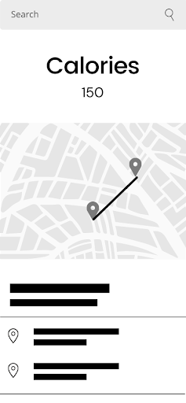
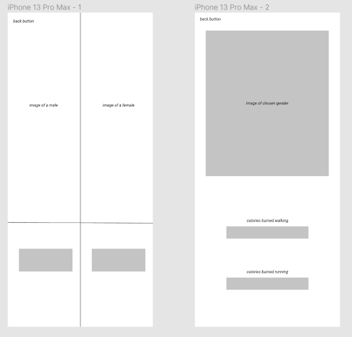
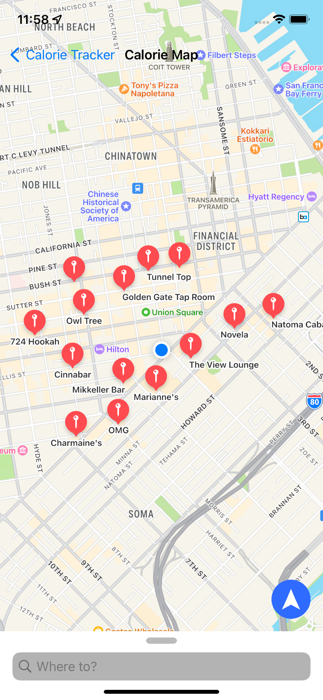

## Table of contents

- [Overview](#overview)
  - [The challenge](#the-challenge)
  - [Screenshot](#screenshot)
- [Our process](#my-process)
  - [Built with](#built-with)
  - [What I learned](#what-i-learned)
  - [Continued development](#continued-development)
  - [Useful resources](#useful-resources)
- [Author](#author)
- [Acknowledgments](#acknowledgments)

<!-- **Note: Delete this note and update the table of contents based on what sections you keep.** -->

## Overview

# CalorieMap
# CSC780 Final Project
## _Calorie Map_
by Michael Satumba and Jarrett Zapata

## Proposal
An app that tracks calories expended given a point a to point b like google maps

## Must Have Features

- Inputting one address that gives you an output of calories expended from your current location

## Nice to Have Features
- Different results outputted given gender as well as potential calories given if they say they were going to walk or run the inputted route

## Wireframes

### The challenge

Users should be able to:

- See how many calories they will lose from current location to inputed location
- See how many steps they have taken
- See how many calories they have taken
- Set health goals

### Screenshot

## Our process

Set up navigation controller, attach appropriate segues, make the map and search bar, and add apple health.

### Built with

- Swift

### What we learned

### Continued development

<!-- Use this section to outline areas that you want to continue focusing on in future projects. These could be concepts you're still not completely comfortable with or techniques you found useful that you want to refine and perfect. -->

- Add app icon

<!-- **Note: Delete this note and the content within this section and replace with your own plans for continued development.** -->

### Useful resources

- [Swift documentation](https://www.swift.org/documentation/) - This helped us to understand how to effectively program in swift.

<!-- - [Example resource 2](https://www.example.com) - This is an amazing article which helped me finally understand XYZ. I'd recommend it to anyone still learning this concept.

**Note: Delete this note and replace the list above with resources that helped you during the challenge. These could come in handy for anyone viewing your solution or for yourself when you look back on this project in the future.** -->

## Author

by Michael Satumba and Jarrett Zapata

<!-- **Note: Delete this note and add/remove/edit lines above based on what links you'd like to share.** -->

## Acknowledgments

<!-- This is where you can give a hat tip to anyone who helped you out on this project. Perhaps you worked in a team or got some inspiration from someone else's solution. This is the perfect place to give them some credit. -->

<!-- **Note: Delete this note and edit this section's content as necessary. If you completed this challenge by yourself, feel free to delete this section entirely.** -->

